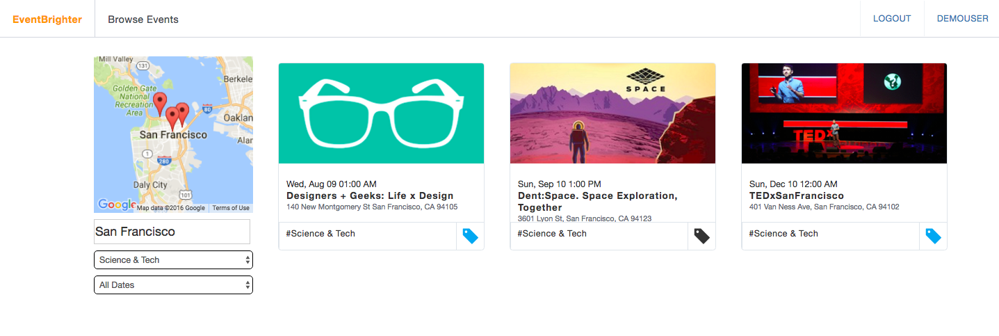
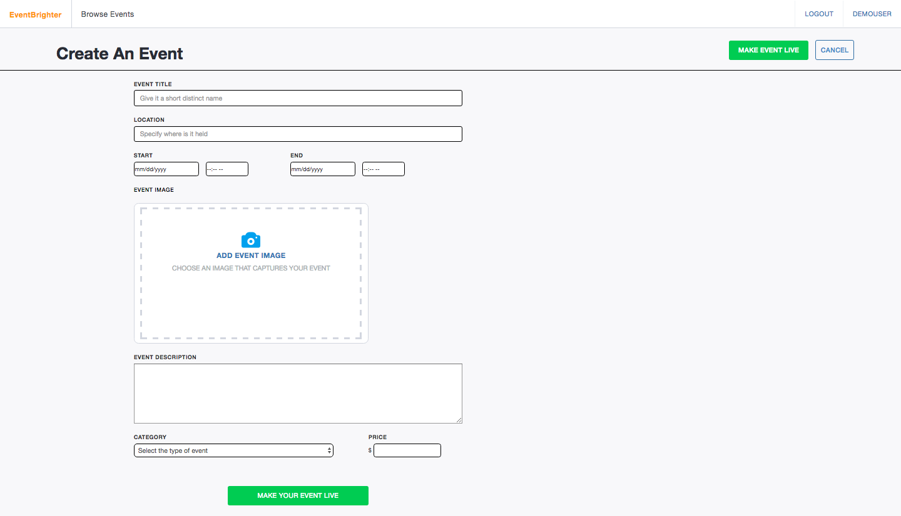

# EventBrighter

[EventBrighter live][heroku]

[heroku]: https://event-brighter.herokuapp.com

EventBrighter is a single-page full stack web application inspired by Eventbrite that is designed to be a global marketplace for live experiences. The application utilizes Ruby on Rails for backend, a PostgreSQL database, and React.js with a Flux architectural framework on the frontend.

## Features

### Dynamic Filtering

Users are able to filter events by cities, categories and dates to receive instant updates. Google Maps API compliments this search by updating the marker position simultaneously. 



The `Search` component stores the filtered paramters as state and gets passed to the `Map` component as props. This triggers `compoonentDidUpdate` to send a AJAX request to the server to fetch all events matching the given paramters along with the lat lng bounds of the current map.

```
// Map Component
componentDidUpdate: function(prevProps, prevState){
    const current = this.props
    if(current.category !== prevProps.category || current.date !== prevProps.date){
        var obj = {
          bounds:{
            northEast: this.northEast,
            southWest: this.southWest
          },
          category: current.category,
          date: current.date
        }
      ClientActions.fetchEvents(Object.assign({},obj))
    }
    if(this.props.singleEvent){
      this._addMarker(this.props.event)
    }else{
      this.props.events.forEach(this._addMarker)
      this.markersToRemove().forEach(this.removeMarker)
   }
 },
```

### Event Creation

EventBrighter allows signed in users to create their own events. The creation form uses Cloudinary API to upload images and a `ErrorStore` using the flux architecture to render error messages. The location paramter is inputted into Google Map's geocoder and depending on the status code, the event is either entered in the database or an error message will render.



## Future Implementations
- Recommend events based upon user's history of past/bookmarked events
- Flexibility in managing user created events
- Account activation via email
